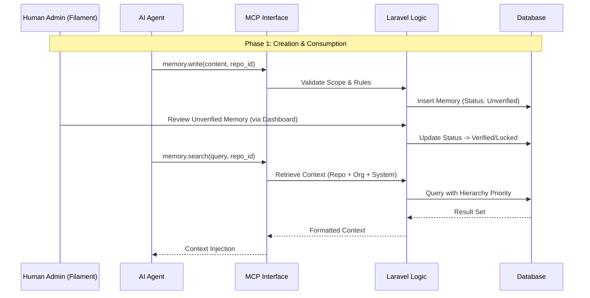
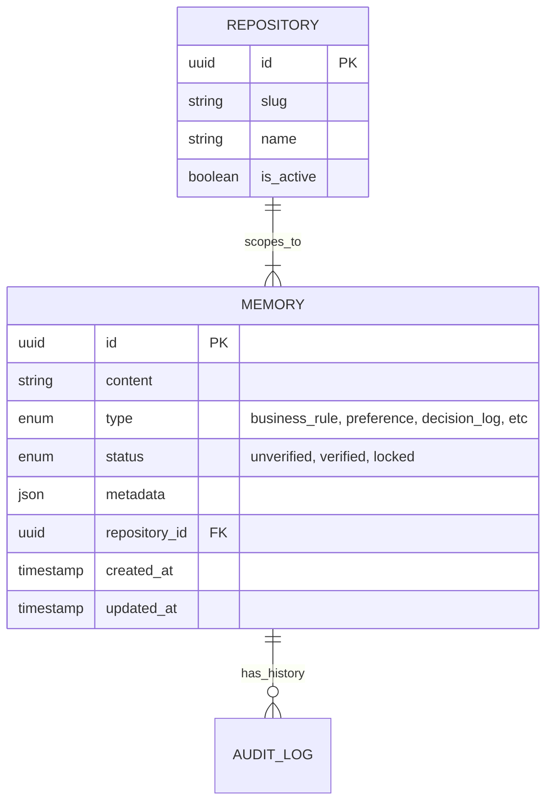

# Memory Management Feature

> Spesifikasi detail dari fitur Memory Management dalam modul MCP Memory Server.

---

## Header & Navigation

- [Back to Module Overview](./overview.md)
- [Link to API Specification](../../api/memory/api-memory.md)
- [Link to Testing Scenario](../../testing/memory/test-memory.md)

---

## 1. Feature Overview

- **Brief Description:** Sistem penyimpanan memori jangka panjang untuk AI Agent dengan isolasi berbasis Repository.
- **Role in Module:** Fitur utama yang menangani siklus hidup memori dari pembuatan oleh AI hingga verifikasi oleh manusia.
- **Business Value:** Mencegah halusinasi AI dengan menyediakan referensi fakta yang terverifikasi dan menjaga kesinambungan konteks antar sesi.

---

## 2. User Stories

### US-01 — Memory Storage & Retrieval
**Sebagai** AI Agent  
**Saya ingin** menyimpan (`write`) dan mencari (`search`) memori berdasarkan konteks repository aktif  
**Sehingga** saya dapat memberikan respon yang konsisten dengan aturan bisnis dan sejarah proyek tersebut tanpa bocor ke proyek lain.

**Acceptance Criteria:**
* Agent dapat menulis memori dengan menyertakan `repository_id`.
* Agent hanya menerima hasil pencarian yang relevan dengan `repository_id` aktif + global/org rules.
* Memory yang bersifat *private* di repo lain tidak muncul di hasil pencarian.

### US-02 — Human Verification
**Sebagai** Manager / Admin  
**Saya ingin** memverifikasi, mengedit, dan mengunci (`lock`) memori melalui Dashboard  
**Sehingga** saya dapat mengoreksi pemahaman AI yang salah dan menetapkan aturan bisnis yang tidak boleh dilanggar (Immutable).

**Acceptance Criteria:**
* Dashboard menampilkan list memori dengan filter Repository.
* Admin dapat mengubah status memori menjadi "Verified" atau "Locked".
* Admin mendapat peringatan jika ada memori level Repository yang bertentangan dengan Global Rules.

### US-03 — Audit Trail
**Sebagai** Auditor  
**Saya ingin** melihat riwayat perubahan (`revision history`) dari setiap unit memori  
**Sehingga** saya tahu apakah sebuah aturan dibuat oleh AI atau diinput manual oleh manusia, dan kapan perubahannya terjadi.

**Acceptance Criteria:**
* Setiap perubahan mencatat `actor` (AI Agent ID atau User ID).
* Perubahan *value* lama dan baru tersimpan.

---

## 3. Business Flow & Rules

### 3.1 Business Flow

### 3.2 Business Rules & Logic

#### A. Repository Scope Strategy
1. **Hierarchy:** Repo Scope > Organization Scope > System Scope.
2. **Immutable:** Jika scope level atas di-lock, scope bawah tidak bisa override.
3. **Isolation:** Data antar `repository_id` terpisah secara absolut.

#### B. Memory Lifecycle
1. **Unverified:** Default saat ditulis oleh AI Agent.
2. **Verified:** Disetujui oleh manusia melalui Filament Dashboard.
3. **Locked:** Permanen, tidak bisa diubah AI, berfungsi sebagai "Golden Rule".

---

## 4. Data Model

---

## 5. Implementation Tasks

### 5.1 Backend Implementation

| Task ID       | Component  | Status | Description                                                                                        |
| :------------ | :--------- | :----- | :------------------------------------------------------------------------------------------------- |
| **MEM-BE-01** | Migration  | Todo   | Create tables: `memories`, `repositories`, `audit_logs`. Index on `repository_id` & `type`.        |
| **MEM-BE-02** | Model      | Todo   | Setup Model `Memory` with Scopes (`RepositoryScope`) & Relations. Implement `Auditable`.           |
| **MEM-BE-03** | Service    | Todo   | Implement `MemoryService`: Logic for hierarchy resolution, collision handling, and search ranking. |
| **MEM-BE-04** | MCP API    | Todo   | Implement JSON-RPC Controller for `memory.write`, `memory.read`, `memory.search`.                  |
| **MEM-BE-05** | Validation | Todo   | Implement Rules: `ImmutableTypeRule` (prevent AI editing locked types).                            |
| **MEM-BE-06** | Seeder     | Todo   | Seed default System Constraints and Demo Repository.                                               |
| **MEM-BE-07** | Tests      | Todo   | Unit Test for Scope Hierarchy fallback. Feature Test for API isolation.                            |

### 5.2 Frontend Implementation (Filament)

| Task ID       | Component  | Status | Description                                                                   |
| :------------ | :--------- | :----- | :---------------------------------------------------------------------------- |
| **MEM-FE-01** | Resource   | Todo   | Create `MemoryResource`. Columns: Content (trunc), Type, Scope Badge, Status. |
| **MEM-FE-02** | Filters    | Todo   | Add Global Filter / Table Filter for `Repository`.                            |
| **MEM-FE-03** | Actions    | Todo   | Custom Actions: "Lock Memory", "Verify Memory".                               |
| **MEM-FE-04** | Widget     | Todo   | Memory Stats Widget (Total verified vs unverified per Repo).                  |
| **MEM-FE-05** | History UI | Todo   | Integrate `activitylog` timeline view into ViewRecord page.                   |
