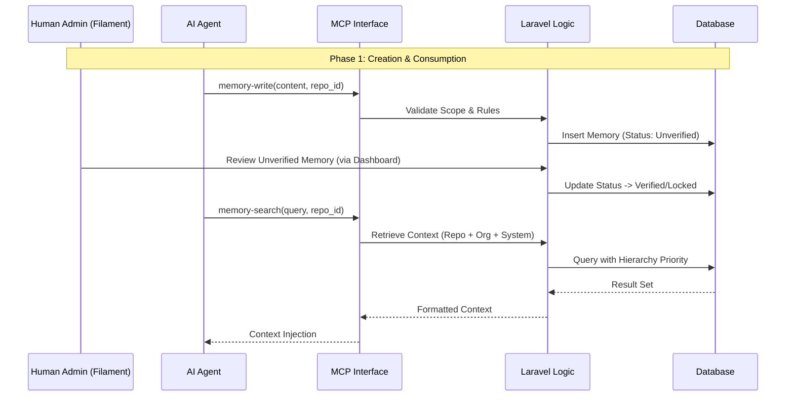
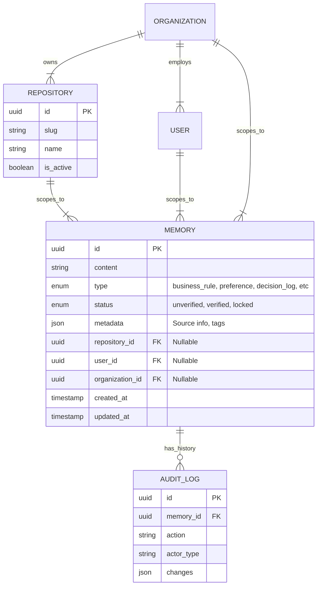

# MCP Memory Server (Laravel + Filament)

> Gunakan template ini untuk mendokumentasikan spesifikasi detail dari setiap FITUR dalam modul secara mendalam.

---

## Header & Navigation

- [Back to Module Overview](./overview.md)
- [Link to API Specification](../../api/memory/api-memory.md)
- [Link to Testing Scenario](../../testing/memory/test-memory.md)

---

## 1. Feature Overview

- **Brief Description:** MCP Memory Server adalah layanan backend terpusat yang berfungsi sebagai *long-term memory persistence layer* untuk AI Agent. Sistem ini menjembatani sifat *stateless* LLM dengan kebutuhan penyimpanan konteks yang persisten, terstruktur, dan dapat diaudit.
- **Role in Module:** Berperan sebagai **Single Source of Truth** untuk knowledge base organisasi dan **Context Provider** bagi AI Agent dalam ekosistem ERP/Procurement. Fitur ini memastikan AI beroperasi dalam batasan aturan bisnis yang ditetapkan manusia.
- **Business Value:**
    - **Hallucination Prevention:** AI bekerja berdasarkan data faktual yang tersimpan, bukan imajinasi.
    - **Context Continuity:** Konteks percakapan dan keputusan masa lalu tetap tersedia lintas sesi.
    - **Auditability:** Setiap perubahan memori tercatat dan dapat diverifikasi oleh manusia via Filament Dashboard.
    - **Multi-Context Isolation:** Fitur **Repository Scope** memastikan agen yang bekerja di satu proyek tidak mencampuradukkan aturan dari proyek lain.

---

## 2. User Stories

### US-01 — Memory Storage & Retrieval

**Sebagai** AI Agent
**Saya ingin** menyimpan (`write`) dan mencari (`search`) memori berdasarkan konteks repository aktif
**Sehingga** saya dapat memberikan respon yang konsisten dengan aturan bisnis dan sejarah proyek tersebut tanpa bocor ke proyek lain.

**Acceptance Criteria:**
* Agent dapat menulis memori dengan menyertakan `repository_id`.
* Agent hanya menerima hasil pencarian yang relevan dengan `repository_id` aktif + global rules.
* Memory yang bersifat *private* di repo lain tidak muncul di hasil pencarian.

### US-02 — Human Verification

**Sebagai** Manager / Admin
**Saya ingin** memverifikasi, mengedit, dan mengunci (`lock`) memori melalui Dashboard
**Sehingga** saya dapat mengoreksi pemahaman AI yang salah dan menetapkan aturan bisnis yang tidak boleh dilanggar (Immutable).

**Acceptance Criteria:**
* Dashboard menampilkan list memori dengan filter Repository.
* Admin dapat mengubah status memori menjadi "Verified" atau "Locked".
* Admin mendapat peringatan jika ada memori level Repository yang bertentangan dengan Global Rules.

### US-03 — Audit Trail

**Sebagai** Auditor
**Saya ingin** melihat riwayat perubahan (`revision history`) dari setiap unit memori
**Sehingga** saya tahu apakah sebuah aturan dibuat oleh AI atau diinput manual oleh manusia, dan kapan perubahannya terjadi.

**Acceptance Criteria:**
* Setiap perubahan mencatat `actor` (AI Agent ID atau User ID).
* Perubahan *value* lama dan baru tersimpan.

---

## 3. Business Flow & Rules

### 3.1 Business Flow

### 3.2 Business Rules & Logic

#### A. Repository Scope Strategy (Fundamental)
Fitur ini menggunakan **Repository Scope** sebagai fondasi isolasi data dan keamanan.

1.  **Repository Definition:**
    *   Entitas logikal yang mewakili satu proyek kode (e.g., `ERP-Backend`, `Procurement-Mobile`).
    *   Diidentifikasi dengan `repository_id` dan `slug` unik.
    *   Bertindak sebagai *Security Boundary* mutlak.

2.  **Scope Hierarchy & Priority:**
    Sistem meresolusi konflik aturan berdasarkan urutan prioritas (dari tertinggi ke terendah):
    *   **Repository Scope (Repo Specific):** Aturan teknis detail per repo. *Menang atas Org/User.*
    *   **User Scope (Personal):** Preferensi gaya kerja user.
    *   **Organization Scope (Corporate):** Aturan umum perusahaan.
    *   **System Scope (Global):** Batasan platform.
    *   *Exception:* Jika scope level atas ditandai **Immutable/Enforced**, maka tidak bisa di-override oleh scope bawah.

3.  **Examples (Contextual):**
    *   *Repo Scope Rule (Procurement):* "Class `TaxCalculator` wajib menggunakan rounding mode `PHP_ROUND_HALF_UP`."
    *   *Repo Scope Rule (Infra):* "Gunakan `t3.medium` untuk staging di repo ini karena memory usage tinggi."
    *   *Org Scope Rule:* "Semua logging harus format JSON." (Dapat di-override repo tertentu jika perlu, kecuali di-lock).

#### B. MCP Endpoint Specifications (Conceptual)
Berikut adalah spesifikasi antarmuka MCP (JSON-RPC) yang wajib diimplementasikan.
**Note:** Endpoint ini adalah **Tools**. Pemanggilan harus menggunakan method `tools/call` dengan parameter `name` sesuai nama tool.

**1. `memory-write`**
*   **Description:** Menyimpan unit memori baru.
*   **Input:**
    *   `content` (string): Payload teks informasi.
    *   `memory_type` (enum): `decision_log`, `preference`, `documentation_ref`.
    *   `repository_id` (uuid): Context repo aktif.
    *   `tags` (array, optional): Label tambahan.
*   **Output:** `memory_id`, `status` (`unverified`).
*   **Validation:** AI **DILARANG** menulis tipe `business_rule` atau `system_constraint`.

**2. `memory-search`**
*   **Description:** Mengambil memori relevan (RAG).
*   **Input:**
    *   `query` (string): Kata kunci pencarian.
    *   `repository_id` (uuid): Context repo aktif.
    *   `limit` (int, default: 5).
*   **Output:** List of objects `{ content, type, scope_badge, reliability_score }`.
*   **Filter Logic:** Hasil hanya mencakup memori milik `repository_id` tersebut ATAU memori global (Org/System). Memori milik repo lain dibuang.

**3. `resources/read`**
*   **Description:** Membaca detail satu memori.
*   **Input:** `uri` (memory://{id}).
*   **Output:** Full object memory termasuk metadata.
*   **Validation:** Cek akses `repository_id`.

**4. `memory-delete`**
*   **Description:** Soft-delete memori usang.
*   **Input:** `memory_id` (uuid), `reason` (string).
*   **Validation:** AI tidak bisa menghapus memori berstatus **Locked**.

#### C. General Rules
1.  **Memory Classification:**
    *   `business_rule`: Locked (Human Only). Scope: Org/Repo.
    *   `system_constraint`: Locked. Scope: System/Repo.
    *   `preference`: Editable. Scope: User.
    *   `decision_log`: Append Only. Scope: Repo.
    *   `documentation_ref`: Editable. Scope: Org/Repo.

2.  **Anti-Hallucination:**
    *   **Source Attribution:** Setiap *retrieval* wajib menyertakan metadata sumber.
    *   **Conflict Resolution:** Jika ada konflik fakta, memori berstatus **Verified** (Human) menang atas *Unverified* (AI).

3.  **Out of Scope Constraints (Fase Ini):**
    *   Tidak ada *Vector Database*.
    *   Tidak ada *Auto-Learning* dari Git Commit.
    *   Tidak ada *File Storage* (hanya teks).

---

## 4. Data Model

---

## 5. Compliance & Audit

- **Audit Logging:** Setiap operasi `write`, `update`, `delete`, dan `lock` pada tabel Memory harus dicatat di tabel `audit_logs` atau menggunakan paket `spatie/laravel-activitylog`.
- **Data Isolation:** Implementasi *Global Scope* pada Eloquent Model untuk memfilter `repository_id` secara otomatis saat context aktif, mencegah kebocoran data antar tenant/repo.
- **GDPR/Retention:** Mendukung *Soft Delete*. Hard delete hanya dilakukan manual oleh Super Admin untuk kepatuhan regulasi.

---

## 6. Implementation Tasks

### 6.1 Backend

| Task ID   | Component  | Status | Description                                                                                        |
| :-------- | :--------- | :----- | :------------------------------------------------------------------------------------------------- |
| MEM-BE-01 | Migration  | Todo   | Create tables: `memories`, `repositories`, `audit_logs`. Index on `repository_id` & `type`.        |
| MEM-BE-02 | Model      | Todo   | Setup Model `Memory` with Scopes (`RepositoryScope`) & Relations. Implement `Auditable`.           |
| MEM-BE-03 | Service    | Todo   | Implement `MemoryService`: Logic for hierarchy resolution, collision handling, and search ranking. |
| MEM-BE-04 | MCP API    | Todo   | Implement JSON-RPC Controller for `memory-write`, `memory.read`, `memory-search`.                  |
| MEM-BE-05 | Validation | Todo   | Implement Rules: `ImmutableTypeRule` (prevent AI editing locked types).                            |
| MEM-BE-06 | Seeder     | Todo   | Seed default System Constraints and Demo Repository.                                               |
| MEM-BE-07 | Tests      | Todo   | Unit Test for Scope Hierarchy fallback. Feature Test for API isolation.                            |

### 6.2 Frontend

| Task ID   | Component  | Status | Description                                                                   |
| :-------- | :--------- | :----- | :---------------------------------------------------------------------------- |
| MEM-FE-01 | Resource   | Todo   | Create `MemoryResource`. Columns: Content (trunc), Type, Scope Badge, Status. |
| MEM-FE-02 | Filters    | Todo   | Add Global Filter / Table Filter for `Repository`.                            |
| MEM-FE-03 | Actions    | Todo   | Custom Actions: "Lock Memory", "Verify Memory".                               |
| MEM-FE-04 | Widget     | Todo   | Memory Stats Widget (Total verified vs unverified per Repo).                  |
| MEM-FE-05 | History UI | Todo   | Integrate `activitylog` timeline view into ViewRecord page.                   |

---
